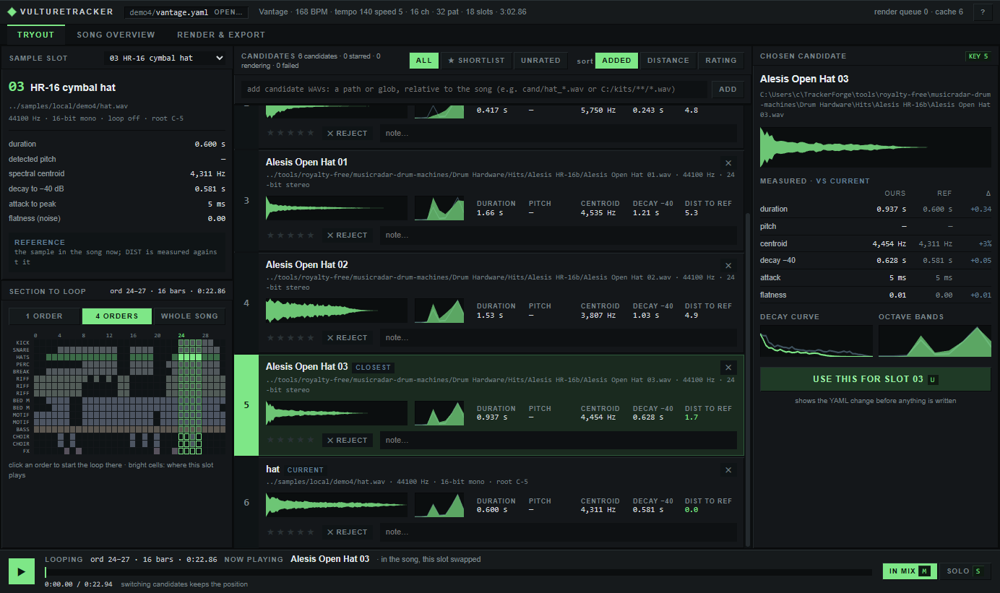
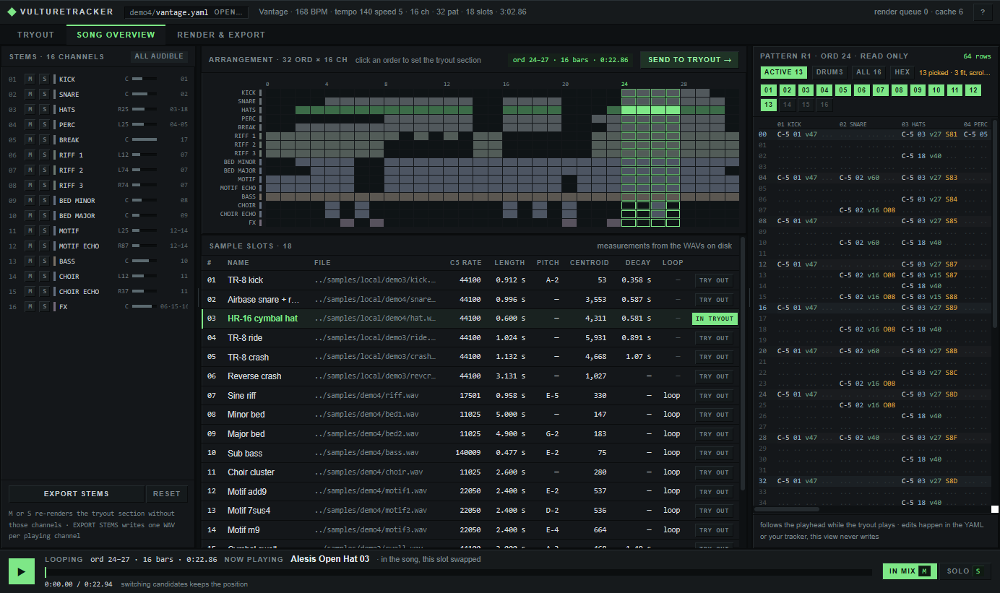

# VultureTracker


Tracker music as text. Write a song as a readable YAML file, compile it to an Impulse Tracker module
(`.it`) that plays in OpenMPT, Schism Tracker or anything built on libopenmpt, and render it to WAV.
Every note, sample, envelope and effect is plain text, so people and AIs edit songs the same way.

```
song.yaml ──build──▶ song.it ──render──▶ song.wav
```

<p align="center"></p>
<p align="center"></p>

## Install

```
git clone https://github.com/shadoh420/VultureTracker.git
cd VultureTracker
pip install pyyaml            # optional: pywebview (app window), numpy (sample measurements)
```

Python 3.10+. Windows x64 has libopenmpt in `vendor/`; elsewhere install libopenmpt or point `LIBOPENMPT` at it.
`pip install pyinstaller && python tools/build_exe.py` builds a single `dist/vulturetracker.exe` instead.

## Use

```
python -m vulturetracker gui demo2/iron_relay.yaml         # the app: try candidate samples inside the song, mix, drop listening notes, read patterns, export stems
python -m vulturetracker check song.yaml                   # validate; errors show file:line
python -m vulturetracker build song.yaml --render song.wav # compile, verify with libopenmpt, render
python -m vulturetracker import some.it -o some.yaml       # existing module -> song file + WAVs
python -m vulturetracker synth recipe.yaml                 # render samples from free synths or recordings
```

Run the app with no song, or double-click the exe, for the open-a-song screen.

## Docs

- [GUIDE.md](GUIDE.md): the app in detail, the four demos and the suite, samples, tests, notes
- [SONG_FORMAT.md](SONG_FORMAT.md): the complete song format
- [SAMPLING.md](SAMPLING.md): making samples with Surge XT, Dexed, OB-Xd and CC0 recordings
- [PROVENANCE.md](PROVENANCE.md): what the demos derive from reference material

## Credits and licenses

VultureTracker is MIT licensed ([LICENSE](LICENSE)) and stands on other people's work:

- [libopenmpt](https://lib.openmpt.org) by the OpenMPT project (BSD-3-Clause) verifies and renders every module. Its
  Windows build in `vendor/` and inside the exe also carries mpg123 (LGPL-2.1, shipped as a separate DLL you can
  replace), libogg and libvorbis from Xiph.Org (BSD-3-Clause) and zlib. License texts are in `vendor/Licenses/`.
- The exe bundles Python (PSF), pywebview (BSD-3-Clause) with Microsoft's WebView2 SDK loader, pythonnet (MIT),
  NumPy (BSD-3-Clause) and PyYAML (MIT), packed by PyInstaller (GPL-2.0 with an exception that leaves the packed
  program under its own license).
- The demo samples credit their sources in `samples/demo3/ATTRIBUTION.md` and `samples/demo4/ATTRIBUTION.md`: CC0
  recordings by Karoryfer Samples and Versilian Studios, renders from Surge XT, Dexed and OB-Xd (GPL-3 programs run
  separately; the audio they render is not GPL), and MusicRadar's royalty-free packs, which are not redistributed.
- demo4 has UT99's Foregone Destruction (Epic Games; composed by Michiel van den Bos) as its stylistic reference for
  grid and layer plan. No audio, melody or sample data from it is included; [PROVENANCE.md](PROVENANCE.md) says exactly
  what was taken and what was changed.
- The Impulse Tracker writer follows [ITTECH.TXT](https://github.com/schismtracker/schismtracker/wiki/ITTECH.TXT)
  and was checked against OpenMPT's loader.

Versions and where each license text lives: [THIRD_PARTY.md](THIRD_PARTY.md).
