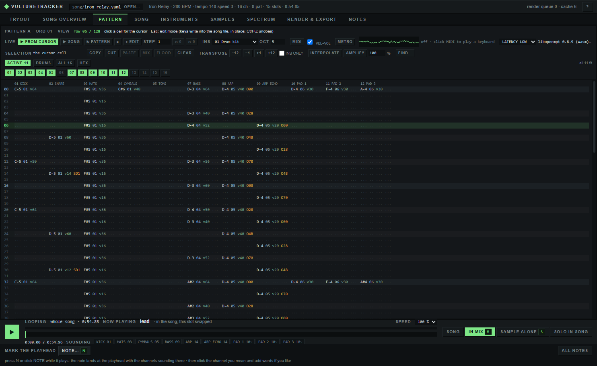
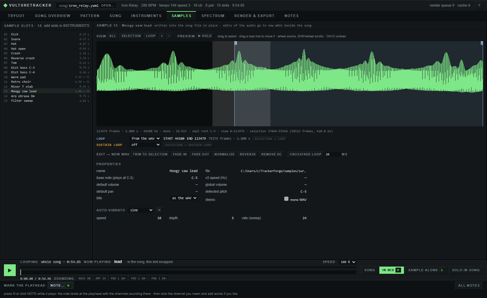

# VultureTracker


Tracker music as text, with a tracker built on it. A song is a readable YAML file that compiles to an Impulse Tracker
module (`.it`), verified by libopenmpt, which plays in OpenMPT, Schism Tracker or anything built on libopenmpt. The app
edits that same file: every note, sample, envelope and effect you change in it is a small in-place change to the text,
checked by compiling the whole song before it is written, and undoable. People, scripts and AIs edit songs the same way.

```
song.yaml ──build──▶ song.it ──render──▶ song.wav / .mp3 / .ogg / .flac
```

<p align="center"></p>
<p align="center"></p>
<p align="center"></p>

## What it does

- **Songs as text.** The song format ([SONG_FORMAT.md](SONG_FORMAT.md)) covers IT's module settings, channels, samples,
  instruments with envelopes and keymaps, patterns in OpenMPT's cell notation and the order list. `check` reports errors
  by file and line; the compiler writes IT 2.14 and has libopenmpt load and verify every build.
- **A live engine.** libopenmpt 0.8.9 compiled to WebAssembly plays in the page's audio thread: play from any row, loop a
  pattern or a span, live mutes and solo, note preview, per-channel VU, a metronome, a scope, and every edit swapped in
  where it plays.
- **Editors.** Pattern editing with a cell cursor, keyboard and MIDI note entry, selections, copy / paste / mix-paste /
  flood, transpose, interpolate, amplify, find and replace. The order list, patterns, channels and song settings. Every
  instrument field, with envelopes as draggable graphs and a keymap editor. A sample editor with a zoomable waveform,
  loop and sustain-loop points, and trim / fade / normalize / reverse / DC removal / crossfaded loops written as new WAVs
  beside the song (never over a source file).
- **Choosing sounds in context.** The Tryout tab renders candidate samples inside the song, measures them against the
  current one and writes the choice with one key; a mixer with channel and sample faders; listening notes dropped at the
  playhead with the channels sounding there, kept as a report for a collaborator who cannot listen; a spectrogram.
- **Import and export.** IT, XM, S3M and MOD files become song files (samples extracted as WAVs, measured against how
  libopenmpt plays the original). Songs render to WAV, MP3, OGG and FLAC, whole or as per-channel stems.
- **Samples by recipe.** `synth` renders samples from free synths (Surge XT, Dexed, OB-Xd) and CC0 recordings by recipe
  ([SAMPLING.md](SAMPLING.md)), with anti-aliased resampling so notes played far from their root stay clean.

## Install

```
git clone https://github.com/shadoh420/VultureTracker.git
cd VultureTracker
pip install pyyaml pywebview numpy imageio-ffmpeg
```

Python 3.10+. Only PyYAML is required to compile songs. pywebview opens the app in its own window (without it, the app
opens in the browser); numpy is needed for measurements, the spectrogram, the sample editor and resampling;
imageio-ffmpeg provides the ffmpeg that the MP3 / OGG / FLAC export runs. Windows x64 has libopenmpt in `vendor/`;
elsewhere install libopenmpt or point `LIBOPENMPT` at it. `pip install pyinstaller && python tools/build_exe.py` builds
`dist/vulturetracker.exe` with `dist/ffmpeg.exe` beside it.

## Use

```
python -m vulturetracker gui demo2/iron_relay.yaml         # the app (no song: the start screen: open, new song, import)
python -m vulturetracker check song.yaml                   # validate; errors show file:line
python -m vulturetracker build song.yaml --render song.wav # compile, verify with libopenmpt, render
python -m vulturetracker import some.xm -o some.yaml       # an .it, .xm, .s3m or .mod -> song file + WAVs
python -m vulturetracker synth recipe.yaml                 # render samples from free synths or recordings
python -m vulturetracker --help                            # every command
```

Tests: `python -m unittest discover tests` (the live-engine checks need node; the page checks need Playwright's Chromium).

## Docs

- [GUIDE.md](GUIDE.md): the app tab by tab, the demos and the suite, samples, tests, notes
- [SONG_FORMAT.md](SONG_FORMAT.md): the complete song format
- [SAMPLING.md](SAMPLING.md): making samples with Surge XT, Dexed, OB-Xd and CC0 recordings
- [PROVENANCE.md](PROVENANCE.md): what the demos derive from reference material
- [AGENTS.md](AGENTS.md): orientation for people and AI agents working on the repository

## Credits and licenses

VultureTracker is MIT licensed ([LICENSE](LICENSE)) and stands on other people's work:

- [libopenmpt](https://lib.openmpt.org) by the OpenMPT project (BSD-3-Clause) verifies and renders every module. Its
  Windows build in `vendor/` and inside the exe also carries mpg123 (LGPL-2.1, shipped as a separate DLL you can
  replace), libogg and libvorbis from Xiph.Org (BSD-3-Clause) and zlib. License texts are in `vendor/Licenses/`.
- The live engine is libopenmpt's official WebAssembly build (BSD-3-Clause and BSL-1.0, with minimp3, miniz and
  stb_vorbis compiled in), in `vulturetracker/web/` with its license texts.
- The exe bundles Python (PSF), pywebview (BSD-3-Clause) with Microsoft's WebView2 SDK loader, pythonnet (MIT),
  NumPy (BSD-3-Clause) and PyYAML (MIT), packed by PyInstaller (GPL-2.0 with an exception that leaves the packed
  program under its own license). [FFmpeg](https://ffmpeg.org) (GPL-3.0) ships beside it as a separate program for the
  encoded exports.
- The demo samples credit their sources in `samples/demo3/ATTRIBUTION.md` and `samples/demo4/ATTRIBUTION.md`: CC0
  recordings by Karoryfer Samples and Versilian Studios, renders from Surge XT, Dexed and OB-Xd (GPL-3 programs run
  separately; the audio they render is not GPL), and MusicRadar's royalty-free packs, which are not redistributed.
- demo4 has UT99's Foregone Destruction (Epic Games; composed by Michiel van den Bos) as its stylistic reference for
  grid and layer plan. No audio, melody or sample data from it is included; [PROVENANCE.md](PROVENANCE.md) says exactly
  what was taken and what was changed.
- The Impulse Tracker writer follows [ITTECH.TXT](https://github.com/schismtracker/schismtracker/wiki/ITTECH.TXT)
  and was checked against OpenMPT's loader.

Versions and where each license text lives: [THIRD_PARTY.md](THIRD_PARTY.md).
