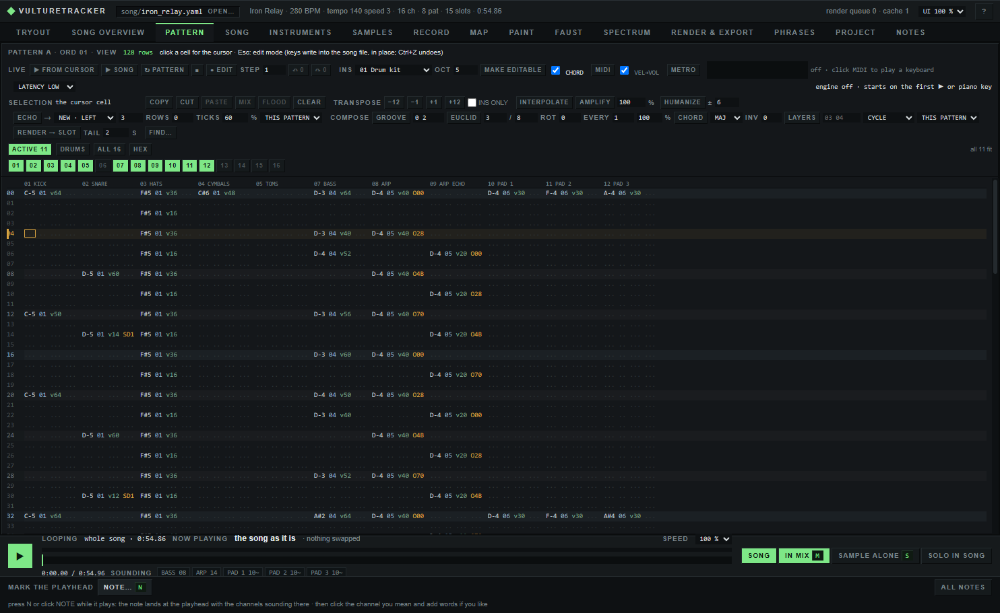
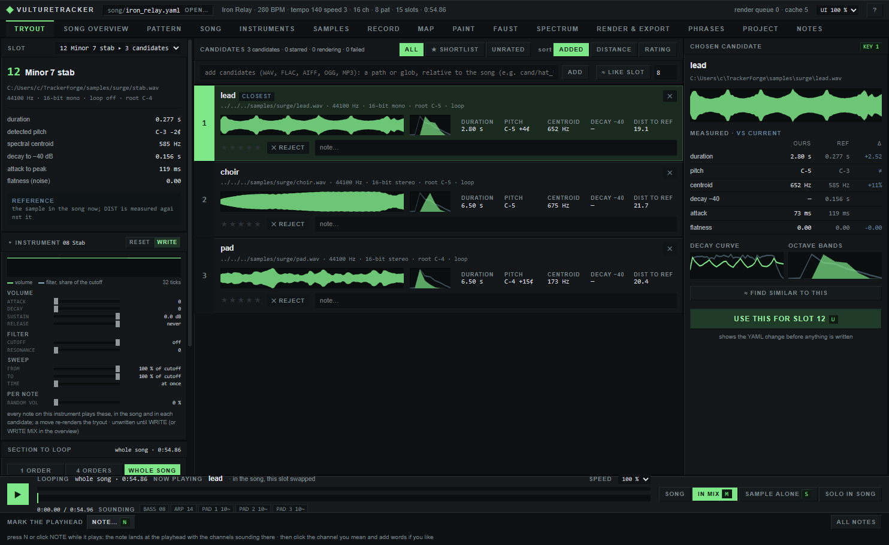
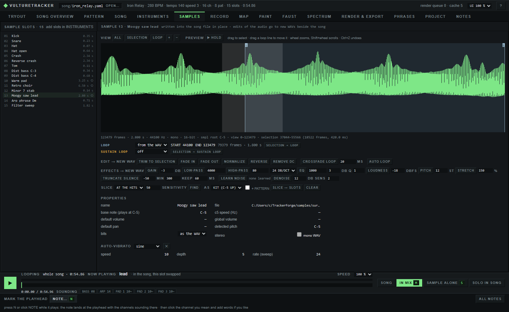

# VultureTracker


Tracker music as text, with a tracker built on it. A song is a readable YAML file that compiles to an Impulse Tracker
module (`.it`), checked by libopenmpt and playable in OpenMPT, Schism Tracker or anything built on libopenmpt. The app
edits that same file in place: every change is checked by compiling the whole song before it is written, and can be
undone. People, scripts and AIs edit songs the same way.

```
song.yaml ──build──▶ song.it ──render──▶ song.wav / .mp3 / .ogg / .flac
```

<p align="center"></p>
<p align="center"></p>
<p align="center"></p>

## What it does

- **A tracker on a text file:** patterns, instruments with envelopes, samples and the order list, with OpenMPT's keys,
  MIDI input and a live engine (libopenmpt in the page) that plays every edit where it is.
- **Choosing sounds in context:** the Tryout renders candidate samples inside the song and measures them; a mixer,
  listening notes, and a sample library searched by timbre.
- **Making sounds:** a sample editor with effects and slicing, recording from an audio interface, Faust code, pictures
  painted into sound, and sample recipes rendered from free synths ([SAMPLING.md](SAMPLING.md)).
- **In and out:** imports IT, XM, S3M, MOD, Guitar Pro 3-5 and MIDI files and WAV, FLAC, AIFF, OGG and MP3 samples;
  exports WAV, MP3, OGG and FLAC, stems and game loops.
- **Files that stay right:** undo history and checkpoints kept with the song, every song from 0.6 on opening unchanged
  in every 1.x ([SONG_FORMAT.md](SONG_FORMAT.md)), and a command line that does what the app does.

## Install

**Windows:** download `vulturetracker-win64.zip` from the [latest release](https://github.com/shadoh420/VultureTracker/releases/latest),
unzip it anywhere and run `vulturetracker.exe`. The start screen lists two demo songs.

**From source** (Python 3.10+; Linux is tested on every push, macOS is untested; outside Windows install libopenmpt,
e.g. `apt install libopenmpt0t64`):

```
git clone https://github.com/shadoh420/VultureTracker.git
cd VultureTracker
pip install -e ".[all]"
python -m vulturetracker gui demo2/iron_relay.yaml
```

[GUIDE.md](GUIDE.md#setup) says what each extra adds and what stays Windows-only.

## Use

```
python -m vulturetracker gui song.yaml                     # the app (no song: open, new song, import)
python -m vulturetracker check song.yaml                   # validate; errors show file:line
python -m vulturetracker build song.yaml --render song.wav # compile, verify with libopenmpt, render
python -m vulturetracker import some.xm -o some.yaml       # a module, a Guitar Pro tab or a MIDI file -> song file
python -m vulturetracker --help                            # every command
```

## Docs

- [GUIDE.md](GUIDE.md): the app tab by tab, the command line, the demos, samples, tests
- [SONG_FORMAT.md](SONG_FORMAT.md): the complete song format
- [SAMPLING.md](SAMPLING.md): making samples with Surge XT, Dexed, OB-Xd, Faust and CC0 recordings
- [CHANGELOG.md](CHANGELOG.md): what changed in each release
- [PROVENANCE.md](PROVENANCE.md): what the demos derive from reference material
- [AGENTS.md](AGENTS.md): orientation for people and AI agents working on the repository

## Credits and licenses

VultureTracker is MIT licensed ([LICENSE](LICENSE)) and stands on other people's work:

- [libopenmpt](https://lib.openmpt.org) by the OpenMPT project (BSD-3-Clause) verifies and renders every module. Its
  Windows build in `vendor/` and inside the exe also carries mpg123 (LGPL-2.1, shipped as a separate DLL you can
  replace), libogg and libvorbis from Xiph.Org (BSD-3-Clause) and zlib. License texts are in `vendor/Licenses/`.
- The live engine is libopenmpt's official WebAssembly build (BSD-3-Clause and BSL-1.0, with minimp3, miniz and
  stb_vorbis compiled in), in `vulturetracker/web/` with its license texts.
- The exe bundles Python (PSF), pywebview (BSD-3-Clause) with Microsoft's WebView2 SDK loader, pythonnet (MIT),
  NumPy (BSD-3-Clause), PyYAML (MIT), mido (MIT), sounddevice with PortAudio (MIT), PyGuitarPro (LGPL-3.0) and [pedalboard](https://github.com/spotify/pedalboard) (GPL-3.0,
  the synth host), packed by PyInstaller; because of pedalboard the exe as a whole is distributed under the GPL-3.0,
  while this repository's code stays MIT ([THIRD_PARTY.md](THIRD_PARTY.md)). [FFmpeg](https://ffmpeg.org) (GPL-3.0) ships beside it as a separate program for the
  encoded exports.
- The demo samples credit their sources in `samples/demo3/ATTRIBUTION.md` and `samples/demo4/ATTRIBUTION.md`: CC0
  recordings by Karoryfer Samples and Versilian Studios, renders from Surge XT, Dexed and OB-Xd (GPL-3 programs run
  separately; the audio they render is not GPL), and MusicRadar's royalty-free packs, which are not redistributed.
- demo4 has UT99's Foregone Destruction (Epic Games; composed by Michiel van den Bos) as its stylistic reference for
  grid and layer plan. No audio, melody or sample data from it is included; [PROVENANCE.md](PROVENANCE.md) says exactly
  what was taken and what was changed.
- The Impulse Tracker writer follows [ITTECH.TXT](https://github.com/schismtracker/schismtracker/wiki/ITTECH.TXT)
  and was checked against OpenMPT's loader.

Versions and where each license text lives: [THIRD_PARTY.md](THIRD_PARTY.md).
